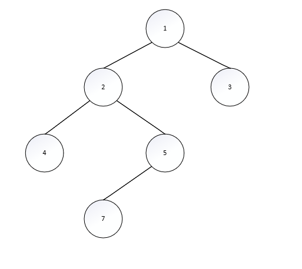

# 树的右侧
- 简介
	- 一个有点变形的二叉树的层序遍历。
- 问题描述
	- 现在有一个果树，该树果子节点符合二叉树的分布，小王按照规定只能摘到从树的右侧看过去看到的第一个节点，求出节点序列。
- 问题分析
	- 举例如下
		- 
		- 假定树形如上，小王得到的结果为1,3,5,7。
	- 其实，这不过是一个层序遍历，求出每一层最后的那个结果而已。
	- 算法流程
		- 初始化队列，将根节点入队，当前第一层。
		- 遍历队列的每个节点，记录此时队列长度，此时这些节点为同一层的，将节点的孩子入队。若节点为长度位置，将其加入结果集。
		- 输出结果。
- 代码
	- ```python
		# -*-coding:utf-8-*-
		
		
		class Node(object):
		    def __init__(self, x):
		        self.val = x
		        self.left = None
		        self.right = None
		
		    def __str__(self):
		        return str(self.val)
		
		
		def solve(root):
		    res = []
		    queue = []
		    queue.append(root)
		    while len(queue) > 0:
		        # 记录每一层节点数目
		        length = len(queue)
		        for i in range(length):
		            node = queue[0]
		            del queue[0]
		            if i == length-1:
		                res.append(node.val)
		            if node.left:
		                queue.append(node.left)
		            if node.right:
		                queue.append(node.right)
		    return res
		
		
		if __name__ == '__main__':
		    f = Node(7)
		    e = Node(5)
		    e.left = f
		    d = Node(4)
		    c = Node(3)
		    b = Node(2)
		    b.left = d
		    b.right = e
		    a = Node(1)
		    a.left = b
		    a.right = c
		
		    print(solve(a))
		```
- 运行结果
	- 
